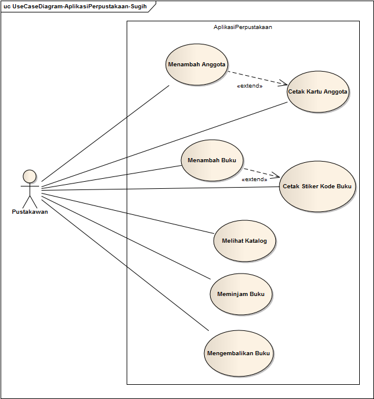

### Use Case Diagram Aplikasi Perpustakaan

Use Case Diagram menggambarkan apa saja yang bisa user lakukan di dalam sistem/aplikasi

 atau in english nya Use Case Diagram defines what user can do to the system.

Adapun Use Case Diagram Aplikasi Perpustakaan sederhana bisa digambarkan sebagai berikut:

Gambar di atas menggambarkan Aplikasi mempunyai satu Actor/user yaitu Pustakawan dan 7 use case. Hal ini menjelaskan bahwa dalam aplikasi, pustakawan bisa Menambah Anggota, Mencetak Kartu Anggota, Menambah Buku, Mencetak Stiker Kode Buku, Melihat Katalog, Meminjam Buku, dan Mengembalikan Buku.

Mungkin ada kebingungan, mengapa yang meminjam dan mengembalikan buku adalah Pustakawan, bukan anggota perpustakaan.

Kalau kita lihat lagi postingan sebelumnya <a href="01 Activity Diagram.md">Business Process atau Activity Diagram</a> , di situ terlihat bahwa yang berinteraksi langsung dengan aplikasi adalah Pustakawan, bukan anggota. Anggota meminjam dan mengembalikan buku kepada Pustakawan, selanjutnya Pustakawan lah yang menginput ke aplikasi.

Dan kalaupun dimungkinkan Anggota bisa melakukan proses peminjaman dan pengembalian buku langsung terhadap aplikasi, hal ini akan membahayakan. Bisa-bisa Anggota menginput proses pengembalian buku padahal secara fisik bukunya tidak dikembalikan. Lama-lama rak-rak buku perpustakaan akan menjadi kosong tidak ada bukunya sedangkan di aplikasi tercatat buku sudah dikembalikan ke perpustakaan.

Selanjutnya kita harus membuat Sequence Diagram untuk masing-masing Use Case tersebut.

Jadi postingan selanjutnya akan memuat 7 Sequence Diagram untuk masing-masing Use Case di Use Case Diagram di atas.

Saya buat dulu ya...