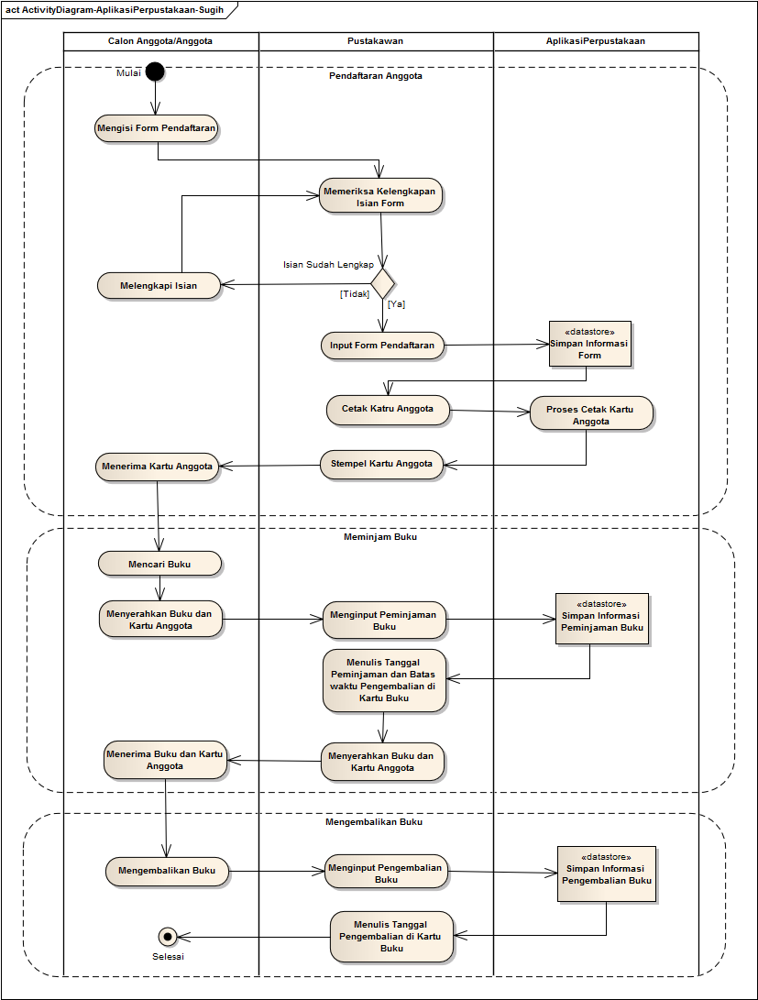

## Business Process atau Activity Diagram Aplikasi Perpustakaan

Kita mulai dengan Business Process atau Activity Diagram. Menggambarkan business process bisa banyak cara. Mungkin secara sederhana saya bisa gambarkan Business Process Model dari Aplikasi Perpustakaan sebagai berikut:

Diagram di atas menggambarkan 3 Activity utama di dalam perpustakaan,yaitu:

1. Menambah anggota/member perpustakaan.
2. Anggota meminjam buku.
3. Anggota mengembalikan buku.

walaupun mungkin masih banyak activity-activity lain yang terkait dengan perpustakaan tetapi bukan merupakan business process yang utama dari perpustakaan.

Jika kita lihat diagram diatas, yang berhubungan langsung dengan aplikasi adalah pustakawan

Maka untuk tahap selanjutnya, yaitu pembuatan Use Case Diagram, Pustakawan adalah Actor nya.

Saya buat dulu Use Case Diagram nya ya...