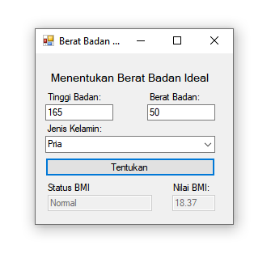

### Aplikasi menghitung Berat Badan Ideal (BMI)

Rumus: `Berat/((Tinggi*tinggi)/10000)`

###### Aturan:

1. BMI untuk wanita
   - Kurus : < 17
   - Normal : 17 - 23
   - Kegemukan: 23 - 27
   - Obesitas : > 27
2. BMI untuk pria
   - Kurus : < 17
   - Normal : 17 - 23
   - Kegemukan: 23 - 27
   - Obesitas : > 27

###### Contoh Output Implementasi menggunakan Visual Basic

